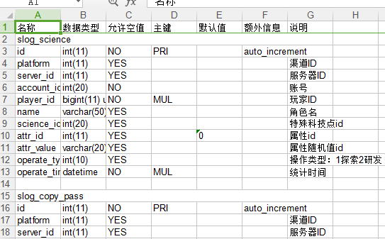
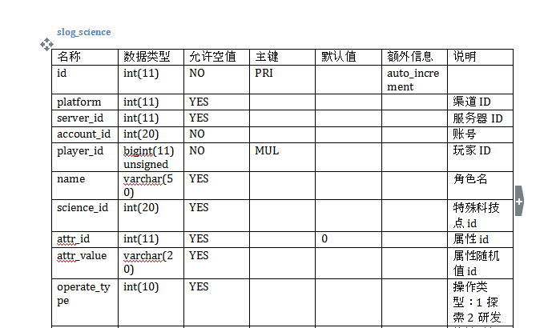
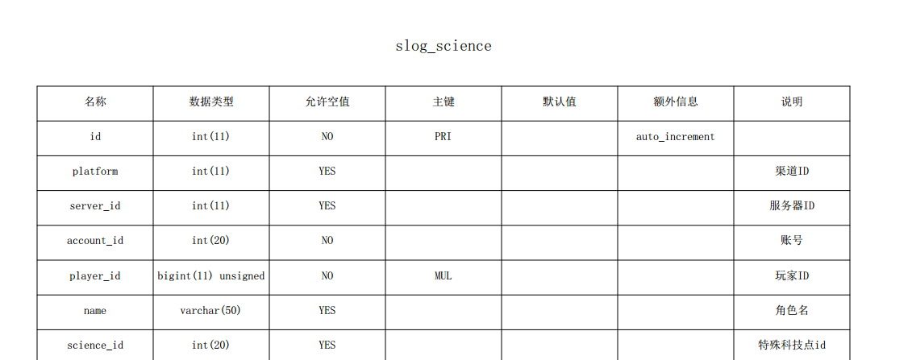
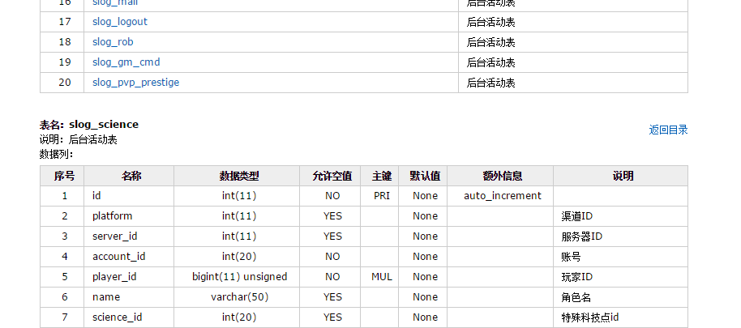

#schema_export

## 简介:
`schema_export`是一个导出数据库结构的工具,支持多种格式

### 支持格式
+ xls  

+ docx  

+ pdf  

+ html  

+ csv

### 支持数据库
+ mysql


## 使用:
### 安装python2.7
```shell
https://www.python.org/ftp/python/2.7.11/python-2.7.11.msi

#配置环境变量
C:\Python27
C:\Python27\Scripts
#加入Path
```

###安装pip
```shell
##下载pip安装脚本
https://bootstrap.pypa.io/get-pip.py
## 用python执行
python get-pip.py
```

### 安装依赖库
```shell
pip install -r requirements.txt
#windows 安装mysql驱动
https://pypi.python.org/pypi/MySQL-python/1.2.5
```


###  运行
```shell
python export.py
#或者用sublime运行
```


## 内容说明
```
├── configs
│   ├── config.conf #配置文件
│   └──  logging.yaml
├── db #获取数据
├── export #导出类
├── formats #导出格式
├── logs   #日志目录
├── templates   #模板
├── output   #输出目录
├── export.py    #文件入口
├── requirements.txt    #依赖
├── README.md     #说明文件
```

### 配置说明
+ `configs/config.conf`日志级别在调试完成后设置为`INFO`级别,减少调试输出


### 任务表
- [x] mysql
- [x] xls
- [x] docx
- [x] pdf
- [x] html
- [x] csv
- [x] 字段注释
- [x]  配置化
- [x]  log
- [x]  outputdir
- [x]  pdf中文乱码
- [x]  word None
- [x]  选择数据库导出
- [x]  表注释